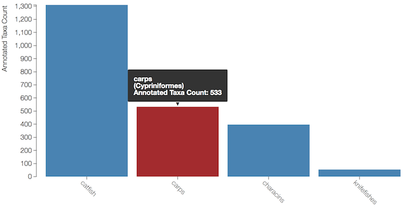
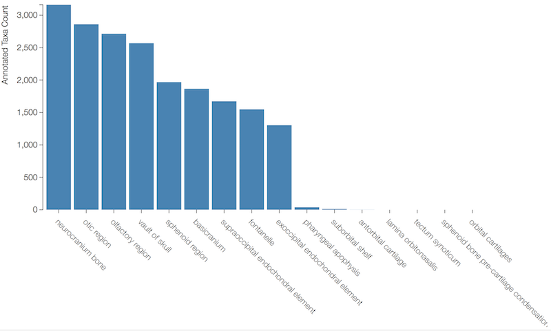

# Phenoscape KB Data Content Visualization

The goal of this project was to create dynamic interactive visualizations of the data content in the Phenoscape Knowledgebase (KB) to increase accessibility and to facilitate broader use of the data in the KB.

## Motivation

This is part of a larger intent to create online dynamic KB data content visualizations that enable insight into broad patterns exhibited by the data along different dimensions, such as taxonomic, anatomical, genomic, and possibly others. Patterns might be data gaps or hotspots (genomic, taxonomic, or anatomical regions with disproportionately few or many data), differences in data distribution between different data sources, and patterns exhibited by different quantitative phenotype similarity metrics. A few such visualizations have been put together laboriously by hand as static figures (Figure 5 in [Dececchi _et al_ 2015], Figure 1 in [Mabee _et al_ 2012]), but even basic online visualizations with which a user can interact have been missing.

## Results

This repo contains several exploratory studies implemented in different languages and using different visualization packages ([d3], [Vega], [Bokeh], [Processing]).

The final interactive data visualization has been [integrated][KB-UI PR] into the online user-interface of the Phenoscape KB at <http://kb.phenoscape.org/#/visualization>. Example screenshots (which are necessarily static) are below.

* Distribution of KB data across the groups within the taxon [otophysi]:
  

* Distribution of KB data across the parts of the [neurocranium]:
  

[Mabee _et al_ 2012]: http://dx.doi.org/10.1111/j.1439-0426.2012.01985.x
[Dececchi _et al_ 2015]: http://dx.doi.org/10.1093/sysbio/syv031
[d3]: https://d3js.org
[Vega]: https://vega.github.io/vega/
[Bokeh]: http://bokeh.pydata.org/
[Processing]: https://processing.org
[KB-UI PR]: https://github.com/phenoscape/phenoscape-kb-ui/pull/104
[otophysi]: http://kb.phenoscape.org/#/taxon/http://purl.obolibrary.org/obo/VTO_0034989?phenotypes.quality_type=quality-phenotype&phenotypes.entity_parts=false&phenotypes.entity_homologs=false&tab=properties
[neurocranium]: http://kb.phenoscape.org/#/entity/http://purl.obolibrary.org/obo/UBERON_0001703?tab=taxa&taxatab=phenotypes&genestab=phenotypes
